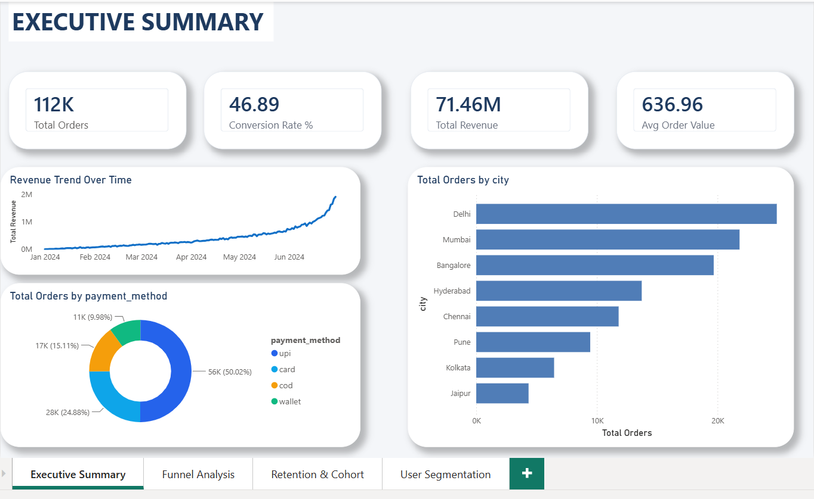
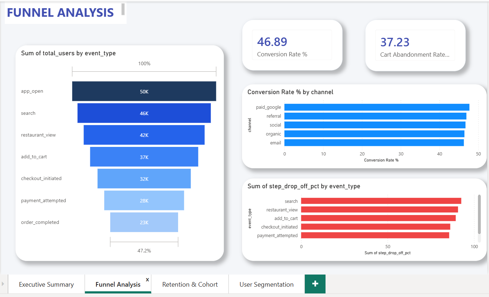
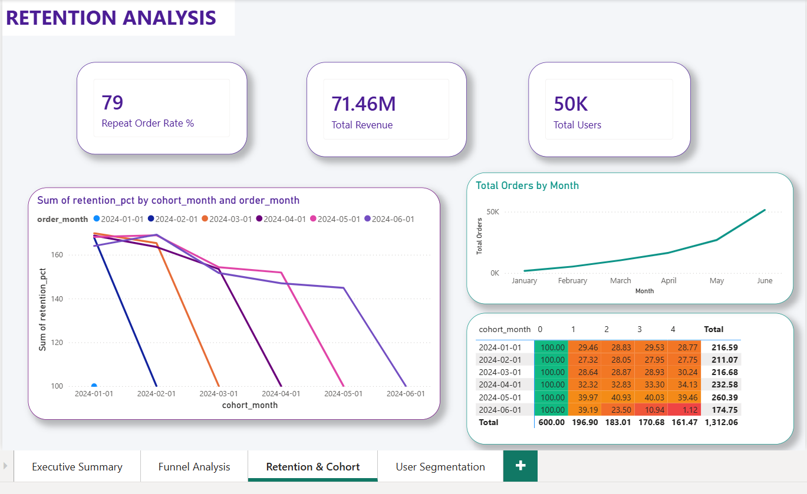
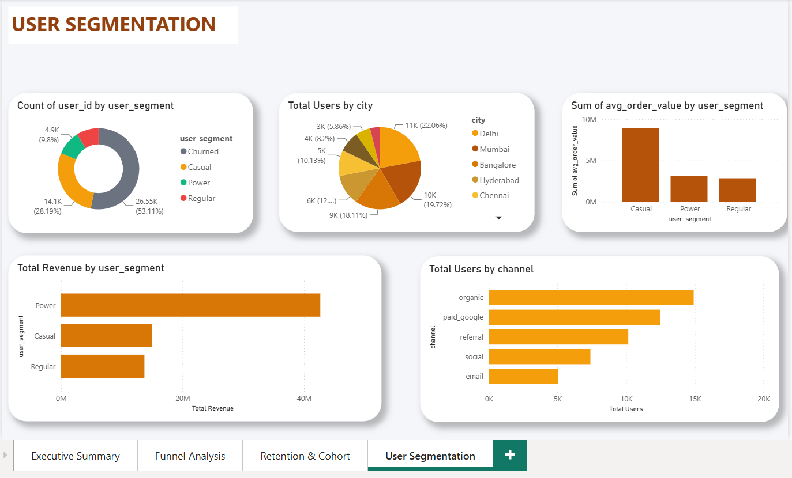

# Product & Funnel Analytics Dashboard

A portfolio-grade product analytics project simulating a food delivery app (similar to Zomato/Swiggy). Built to demonstrate SQL, Power BI, and DAX skills relevant to product and data analyst roles.

---

## Project Overview

This project analyzes a simulated food delivery app's user journey — from app open to order completion. It covers funnel analysis, retention, cohort analysis, and user segmentation across 50,000 users and ~1.47 million events over 6 months.

---

## Tech Stack

| Tool | Usage |
|------|-------|
| Python | Synthetic data generation |
| MySQL | Database, schema, SQL views |
| Power BI | Dashboard, DAX measures |
| DAX | KPI calculations |

---

## Dataset

Synthetically generated using Python — simulates a real food delivery app event stream.

| Table | Rows | Description |
|-------|------|-------------|
| users | 50,000 | User profiles, city, device, channel |
| sessions | ~325,000 | User sessions |
| events | ~1,470,000 | Raw event stream |
| orders | ~112,000 | Completed transactions |
| user_segments | ~44,000 | Monthly user segmentation |

**Event funnel:**
```
app_open → search → restaurant_view → add_to_cart → checkout_initiated → payment_attempted → order_completed
```

---

## SQL

### Tables
- `users`, `sessions`, `events`, `orders`, `user_segments`

### Views
| View | Purpose |
|------|---------|
| vw_funnel_analysis | Step-wise funnel conversion & drop-off |
| vw_dau_wau_mau | Daily, weekly, monthly active users |
| vw_retention_analysis | Weekly retention by cohort |
| vw_cohort_analysis | Monthly cohort retention |
| vw_user_segmentation | User segments with RFM-style metrics |
| vw_cart_abandonment | Cart abandonment rate & value |

**Key SQL concepts used:** CTEs, Window Functions, LAG, LEAD, ROW_NUMBER, FIRST_VALUE, PARTITION BY

---

## Power BI Dashboard

### Pages

**1. Executive Summary**
- Total Orders, Conversion Rate, Total Revenue, Avg Order Value
- Revenue trend over time
- Orders by city
- Orders by payment method

**2. Funnel Analysis**
- User funnel — app open to order completed
- Step-wise drop-off %
- Conversion rate by acquisition channel
- Cart abandonment rate

**3. Retention & Cohort**
- Weekly retention heatmap by cohort
- Cohort retention trend
- Monthly orders trend
- Repeat order rate

**4. User Segmentation**
- Users by segment (Power/Regular/Casual/Churned)
- Revenue by segment
- Users by city and acquisition channel
- Avg order value by segment

### DAX Measures
- Total Orders, Total Revenue, Avg Order Value
- DAU, Total Users
- Conversion Rate %
- Cart Abandonment Rate %
- Repeat Order Rate %

---

## Key Insights

- Overall funnel conversion rate: ~47%
- Cart abandonment rate: ~37%
- Power users (top 10%) drive majority of revenue
- UPI dominates payment methods at ~50%
- Delhi and Mumbai are top cities by order volume
- Organic channel has highest user base; paid_google converts well

---

## Project Structure

```
Funnel-Analytics/
├── data/
│   ├── users.csv
│   ├── sessions.csv
│   ├── events.csv
│   ├── orders.csv
│   └── user_segments.csv
├── sql/
│   ├── schema.sql
│   ├── views.sql
│   └── analysis_queries.sql
├── screenshots/
│   ├── ExecutiveSummary.png
│   ├── FunnelAnalysis.png
│   ├── RetentionCohort.png
│   └── UserSegmentation.png
├── generate_data.py
└── README.md
```

---

## Dashboard Screenshots

### Executive Summary


### Funnel Analysis


### Retention & Cohort


### User Segmentation


---

## Skills Demonstrated

- Advanced SQL — CTEs, Window Functions, Funnel & Cohort Analysis
- Power BI — Multi-page executive dashboard
- DAX — Custom KPI measures
- Product Analytics — Funnel, Retention, Segmentation
- Data Generation — Python synthetic data pipeline

---

## Author

**Akshit Sharma**  
[GitHub](https://github.com/Akshit-Sharma349)
